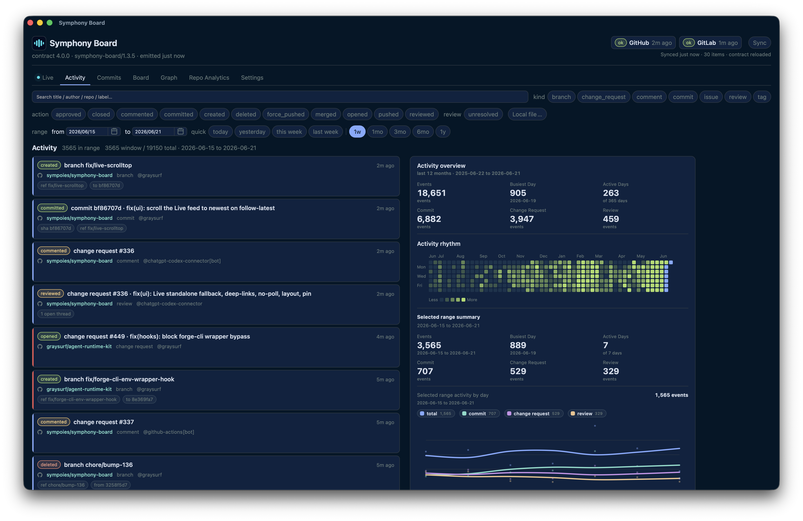

# symphony-board

[](https://github.com/sympoies/symphony-board/actions/workflows/ci.yml)
[](https://github.com/sympoies/symphony-board/actions/workflows/ci.yml)

[](docs/assets/readme-activity.png)

Provider-agnostic work-item board for GitHub and GitLab. It syncs issues and
pull/merge requests from configured projects into a canonical store (SQLite by
default, Postgres by opt-in compose), derives typed relationships between them,
emits a versioned JSON contract, and serves a read-only web UI from that
contract.

The product surface is the contract plus UI. The database is an implementation
store, not the consumer API.

- Design rationale: [docs/DESIGN.md](docs/DESIGN.md)
- Contract rules: [docs/CONTRACT.md](docs/CONTRACT.md)
- Developer guide: [DEVELOPMENT.md](DEVELOPMENT.md)
- UI package: [packages/ui](packages/ui)
- Contract package: [packages/contract](packages/contract)

## Features

The full product path is implemented end to end:

- GitHub and GitLab GraphQL sources fetch issues and change requests; REST
  activity surfaces add commit and repository/project event records.
- Raw provider payloads, canonical rows, labels, sync state, relationship
  edges, and activity rows are stored in the configured canonical store.
- `sync` supports full and incremental modes; only a full and complete sweep may
  soft-delete unseen items or edges.
- `emit` produces contract major v3, currently `3.4.0`, and validates the JSON
  envelope before writing.
- The UI renders the contract as a 7-column Board, a relationship Graph, an
  Activity feed, a GitHub-like Commits log, a Repo Analytics table/trend view,
  and persistent Settings. Board, Graph, Activity, Commits, and Repo Analytics
  share one URL-backed date-range control with a browser-local default preset.
- Docker Compose runs the sync/emit loop as the sole writer, a read-only range
  API sidecar over the configured store, and a read-only web sidecar over the
  latest emitted contract. `docker/compose.yaml` is the default SQLite stack;
  `docker/compose.pg.yaml` is a fully independent Postgres stack for deployment
  validation and opt-in use.
- `packages/desktop` builds a thin macOS app with Tauri. It bundles the same
  read-only UI and connects to the Docker/server HTTP surface; SQLite, provider
  tokens, sync, and the API sidecar stay server-side.
- `packages/desktop-standalone` builds the fully self-contained macOS app: the
  same UI plus the bundled Node runtime running the whole backend
  (`src/cli/app-server.ts`) against a per-user data directory — an alternative
  to the Docker stack for a single-machine install, not a replacement for the
  thin client.
- A writer-owned config control plane lets the UI edit producer config
  (sources, repos, display names) and set provider tokens write-only, gated by
  `CONFIG_CONTROL_ENABLED` + the same-origin header — on by default in the
  standalone app (which onboards entirely in-app), off in the Docker stack
  (file-based config stays the interface there). See
  [docs/DESIGN.md](docs/DESIGN.md).
- CI runs backend checks, UI build/tests/render-smoke, the Postgres driver e2e
  and Postgres compose-deployment gates, a shellcheck pass, and a combined
  logic-tier coverage gate.

Historical validation details and PR links live in [docs/devlog](docs/devlog).

## Architecture

```text
providers --fetch--> [1] raw store
                       opaque provider payloads
                       |
                       | normalize (pure)
                       v
                    [2] canonical DB
                       item / edge / activity / label / sync_*
                       |
                       | buildContract (pure)
                       v
                    [3] contract
                       versioned JSON -> UI / consumers
```

- **Layer 1: raw store** keeps the latest opaque provider payload per entity.
  This lets normalization or contract changes be replayed without re-fetching
  from providers.
- **Layer 2: canonical DB** is provider-agnostic and queryable. It is optimized
  for sync, reconciliation, and local inspection.
- **Layer 3: contract** is the semver consumer surface. It is defined in
  [`@symphony-board/contract`](packages/contract) and emitted by the backend.

The central model is the issue <-> PR/MR relationship. `closes` edges carry a
derived lifecycle:

- `declared`: work is linked but not fulfilled.
- `fulfilled`: change request merged and target issue closed.
- `broken`: change request closed without merging.

The graph also supports non-lifecycle edges such as `mentions` and `relates`
where a provider exposes enough information.

Activity rows are separate from items and edges. Items are current state;
activity records are timestamped developer-significant events such as commit
pushes, branch/tag events, reviews, and issue or PR/MR open/close/merge
transitions.
Commit activity details may include the full commit body and the provider
default branch/ref when the REST source exposes that metadata.

## Workspace

This is a pnpm workspace:

- repo root: backend CLI, sync engine, SQLite/Postgres schema, sources, tests,
  CI helpers
- `packages/contract`: contract JSON Schema and TypeScript DTOs
- `packages/ui`: Vite + React read-only board
- `packages/desktop`: Tauri macOS shell for the UI

The backend runs TypeScript directly under Node 24 type stripping. There is no
backend build step; the Docker image installs root production runtime
dependencies so the lazy-loaded Postgres driver can resolve when a deployment
selects it. The UI is the deliberate home for browser dependencies and a build
step.

## Quick Start

Requirements:

- Node >= 24, normally selected with `fnm use` from `.node-version`
- pnpm >= 11, pinned by `packageManager`

```sh
fnm use
pnpm install

pnpm run typecheck
pnpm test
pnpm --filter @symphony-board/ui run build
pnpm --filter @symphony-board/ui run test
pnpm --filter @symphony-board/ui run smoke
pnpm coverage
```

Configure sources:

```sh
cp config/sources.example.json config/sources.json
$EDITOR config/sources.json

export GITHUB_TOKEN="$(gh auth token)"
export GITHUB_TOKEN_BACKUP="ghp_xxx"  # optional: use a different GitHub account
export GITLAB_TOKEN="glpat_xxx"   # only when a GitLab source is configured
```

Tokens are referenced by env-var name in config and read from the environment.
Do not inline tokens in `config/sources.json`. For GitHub, add optional
`fallback_token_envs` to a source to retry the same request with another PAT
when GitHub clearly reports primary rate-limit exhaustion for the current token.
Use a PAT from a different GitHub account; multiple PATs from the same account
share the same user quota.

A source may also set `"enabled": false` to stay in the config while being
skipped by every sync run. Use this for temporarily unreachable providers (for
example a self-hosted GitLab that needs VPN on one host) instead of removing and
later reconstructing the source.

Initialize and run one full sync:

```sh
pnpm run init-db
node src/cli/sync.ts --dry-run
pnpm run sync
pnpm run emit --out data/contract.json
pnpm run validate --in data/contract.json
```

A source is skipped with a warning when it has `"enabled": false` or when none
of its configured token env vars is set. `--dry-run` fetches and normalizes but
writes nothing.

Useful sync flags:

```sh
node src/cli/sync.ts --incremental
node src/cli/sync.ts --source github:github.com
node src/cli/sync.ts --config path/to/sources.json --dry-run
```

## Run The UI Locally

The UI fetches `./contract.json` relative to the app.

```sh
pnpm run emit --out packages/ui/public/contract.json
pnpm --filter @symphony-board/ui dev
```

For a production-style local check:

```sh
pnpm --filter @symphony-board/ui run build
pnpm --filter @symphony-board/ui run preview
```

The tracked `packages/ui/public/contract.json` is a small sample contract for
development and smoke tests. UI-only dev serves the static contract file; use
the Docker stack when testing the default `this week` range or other custom date
ranges through `/api/range`.
Runtime output under `data/` remains gitignored.

## Run Continuously

Docker Compose runs three services in both store modes:

- `board`: the sole writer. A Node daemon loops `sync` + `emit` on a timer and
  also serves a writer-owned control surface for UI-triggered manual syncs (see
  below) plus its recent-log tail on `GET /api/logs` for the hidden Diagnostics
  page (`#/debug`, toggled with Cmd+/ or Ctrl+/).
- `api`: a read-only Node sidecar. It opens the configured store read-only and
  serves `GET /api/range?from=YYYY-MM-DD&to=YYYY-MM-DD`, review cleanup
  discovery on `GET /api/review-candidates`, plus store statistics on
  `GET /api/stats`.
- `web`: a read-only nginx sidecar that serves the built UI and the daemon's
  latest `data/contract.json` as `/contract.json`, proxies `/api/range` and
  `/api/stats` / `/api/review-candidates` to the read-only `api`, and proxies
  the sync-control and log-tail routes to `board`.

```sh
cat > .env <<'EOF'
GITHUB_TOKEN=ghp_xxx
GITHUB_TOKEN_BACKUP=ghp_xxx_from_a_different_account
EOF
# add GITLAB_TOKEN=... if configured
cp config/sources.example.json config/sources.json
$EDITOR config/sources.json

docker compose -f docker/compose.yaml up -d --build
docker compose -f docker/compose.yaml ps
open http://localhost:8080
```

The default stack uses SQLite at `db_path`. To validate or run the independent
Postgres stack, copy the pg config template and use the pg compose file:

```sh
cp config/sources.pg.example.json config/sources.pg.json
$EDITOR config/sources.pg.json

docker compose -f docker/compose.pg.yaml up -d --build
docker compose -f docker/compose.pg.yaml ps
open http://localhost:18080
curl -fsS http://localhost:18080/api/stats
```

`docker/compose.pg.yaml` uses a separate Compose project name
(`symphony-board-pg`), loopback ports (`18080` for web, `15432` for Postgres),
a stack-private Postgres data volume, and a stack-private contract volume. The
config carries `"db_url_env": "SYMPHONY_DB_URL"`; compose supplies
`SYMPHONY_DB_URL` for its internal `postgres` service by default. If you
override `SYMPHONY_PG_USER`, `SYMPHONY_PG_PASSWORD`, or `SYMPHONY_PG_DATABASE`,
set `SYMPHONY_DB_URL` to the matching URL as well. Use `docker compose -f
docker/compose.pg.yaml down -v` to delete the independent pg database and
generated contract volume.

The agent deploy entrypoint (`.agents/scripts/deploy.sh`, used by the `deploy`
skill) builds and starts whichever stack the `SYMPHONY_BOARD_ENV` switch in
`.env` selects — `postgres` → `docker/compose.pg.yaml`, `sqlite` or unset →
`docker/compose.yaml` — the same switch `project-review-cleanup` reads, so the
two never target different stacks. The explicit `docker compose -f …` commands
above stay valid for ad-hoc use.

The deployment smoke gate for this path is:

```sh
pnpm run test:pg-compose
```

The daemon defaults to `INTERVAL=120` seconds and `FULL_EVERY=30`, which means a
full sweep on the first loop and then about once per hour, with incremental
runs about every 2 minutes in between. Set `FULL_EVERY=1` to always full-sweep.

Only full, complete sweeps can tombstone disappeared items and intra-source
edges. Partial, failed, and incremental runs never delete.

### Manual sync from the UI

Browser reload only reloads the latest emitted `contract.json`; it does not ask
providers for new data. The UI's **Sync** action triggers a real provider sync +
contract emit through the `board` daemon, then reloads the contract in place
(keeping your route, search, filters, and time range). Use it for an immediate
update or a provider-connectivity check between scheduled loops; rely on the
background loop for hands-off freshness, and a browser reload only to re-read the
last emit.

The control plane keeps `board` the only writer: manual and scheduled syncs
share one lock and never overlap, and the read-only `api` sidecar is untouched.
The Compose stack enables it via `SYNC_CONTROL_ENABLED=1` on `board`; the control
port (`SYNC_CONTROL_PORT`, default 8080) stays internal to the Compose network
and is never published to the host. Mutating requests require a same-origin
`X-Symphony-Sync-Control` header, so a blind cross-site POST is rejected. Remove
`SYNC_CONTROL_ENABLED` to keep the daemon timer-only and refuse manual runs (the
UI then hides the Sync action). The Header action runs an incremental sync of all
sources; Settings exposes full sweep, dry-run, and source-scoped runs.

### Editing sources from the UI

A second writer-owned capability lets Settings -> Sources edit the producer
config itself: add/remove sources and repos, edit display names, and set
provider tokens through a write-only secrets surface (values are never read
back). The daemon validates with the same rules as `loadConfig` and writes
atomically; edits apply on the next sync run without a restart. Removing a
source or repo stops syncing it but keeps already-synced history.

It is gated by `CONFIG_CONTROL_ENABLED` plus the same same-origin header as
sync control, and it is **off by default in the Docker stack**. Trusted
single-user deployments can opt in with a compose override that makes
`config/` writable for the writer daemon and provides a write-only token file:

```yaml
services:
  board:
    environment:
      CONFIG_CONTROL_ENABLED: "1"
      SYMPHONY_SECRETS_FILE: config/secrets.env
    volumes:
      - ${SYMPHONY_CONFIG_DIR:-../config}:/app/config
```

Keep this behind a private network such as Tailscale; there is no user auth
layer on the config writer. The standalone desktop app enables the same control
plane by default and onboards new installs entirely in-app. See
[docs/DESIGN.md](docs/DESIGN.md) for the full decision record, including why
the config file stays JSON.

## Build The macOS App

Two desktop options share the same UI:

**Thin client** (`packages/desktop`): bundles the React UI and connects to a
running `symphony-board` server. It does not contain SQLite, provider tokens,
or the sync daemon.

```sh
fnm use
pnpm install
pnpm desktop:build
open "packages/desktop/src-tauri/target/release/bundle/macos/Symphony Board.app"
```

In Tauri, the default server URL is `http://localhost:8080/`, matching the
Docker stack. Change it from Settings -> Server for an always-on hosted server.

**Standalone** (`packages/desktop-standalone`): the fully self-contained app —
UI plus the bundled Node runtime, sync daemon, SQLite store, and contract
server in one `.app`, no Docker or server required. First run onboards
entirely in-app (add a source, paste a token, run the first sync); config,
tokens, and data live under
`~/Library/Application Support/com.sympoies.symphony-board.standalone/`; see
[packages/desktop-standalone/README.md](packages/desktop-standalone/README.md)
for setup.

```sh
fnm use
pnpm install
pnpm desktop-standalone:build
open "packages/desktop-standalone/src-tauri/target/release/bundle/macos/Symphony Board Standalone.app"
```

For self-use on the same Mac, no paid Apple Developer Program membership is
required. Local builds are not notarized; they usually open directly, but if
macOS blocks a launch, unblock the bundle with `scripts/install-release-app.sh`
(below).

GitHub Releases include unsigned CI-built desktop zips for both Apple Silicon
and Intel Macs:

- `Symphony-Board-vX.Y.Z-macos-arm64-unsigned.zip`
- `Symphony-Board-vX.Y.Z-macos-x64-unsigned.zip`
- `Symphony-Board-Standalone-vX.Y.Z-macos-arm64-unsigned.zip`
- `Symphony-Board-Standalone-vX.Y.Z-macos-x64-unsigned.zip`

Use the matching architecture for each Mac. These release builds are unsigned
and not notarized, so macOS quarantines the download and Gatekeeper blocks the
first launch. Install with the helper — it extracts (for a `.zip`), strips the
quarantine flag, copies the bundle into `/Applications`, and opens it:

```sh
scripts/install-release-app.sh ~/Downloads/Symphony-Board-vX.Y.Z-macos-arm64-unsigned.zip
# or, with no argument, pick the newest Symphony-Board-*.zip in ~/Downloads:
scripts/install-release-app.sh
```

To do it by hand instead: clear the flag with
`xattr -dr com.apple.quarantine "<app>"`, or, on macOS Sequoia and later, use
System Settings -> Privacy & Security -> Open Anyway after the first blocked
launch.

Read-only inspection helpers:

```sh
scripts/db-summary.sh
scripts/contract-summary.sh
scripts/devlog-search.sh graph
```

## Contract Summary

The current emitted contract is major v3, currently `3.4.0`. The canonical
schema, field semantics, version rules, and full version history live in
[docs/CONTRACT.md](docs/CONTRACT.md). The TypeScript DTO and JSON Schema entry
point is [`@symphony-board/contract`](packages/contract).

Consumers must branch on contract major and ignore unknown fields within a
major. Producers validate strictly before emitting.

Current consumer-facing semantics:

- `items[]` is a windowed payload in v2+; use `aggregates[]` and `repo_stats[]`
  for full totals and inventory counts.
- `item_window` describes the loaded primary Board window and whether the
  emitted payload is truncated.
- Static emits usually omit `range_query`; `/api/range` includes it and returns
  a windowed contract for the requested date range.
- `repo_metrics[]` is range-scoped analytics for Repo Analytics. `repo_stats[]`
  remains the full inventory/count surface for Settings and external consumers.
- `timezone` controls calendar-day range expansion, presets, and day / week /
  month series buckets. Older contracts without it should be treated as UTC.
- `repo_metrics[].repo_url` and `activities[].url` are producer-filled provider
  destinations when the source can prove a stable target.

Display colors are contract metadata, read from config at emit time and never
stored in the canonical store. The UI resolves highlight color in this order:

```text
browser repo override -> repos[] color -> sources[].color -> no highlight
```

## Testing Model

CI runs these jobs:

- backend/root: `pnpm run typecheck` and `pnpm test`
- UI: `pnpm --filter @symphony-board/ui run build`, UI tests, and render-smoke
- Postgres driver e2e: `pnpm run test:pg-e2e` (store-conformance + live e2e
  against a composed-up Postgres)
- Postgres compose deployment: `pnpm run test:pg-compose` (the independent pg
  stack, asserting the served contract and `driver: "postgres"`)
- shell: `shellcheck` over `scripts/**/*.sh`
- coverage: `pnpm coverage`, a combined line-coverage floor over backend `.ts`
  and UI `.ts` logic, plus a coverage-badge publish job

The React `.tsx` component layer is not folded into the coverage percentage.
Bundled browser coverage reports misleading near-100% loaded code, so the UI
component gate is the headless Chrome render-smoke instead.

When touching a source or the sync engine, also run a real `--dry-run` against a
safe config if credentials/network access are available. Prefer recorded or
throwaway fixtures over live provider calls in automated tests.
