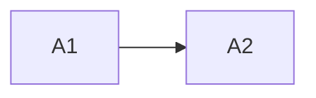

## Phase table

- [ ] **A1** First: #1
- [ ] **A2** Second: #2 · after A1
- [ ] **A1** Third reuses an id: #3
- [ ] **A1** Fourth reuses it again: #4

## Dependency graph

```mermaid
graph LR
  A1
  A2
  A1 --> A2
```
