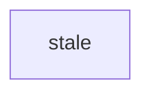
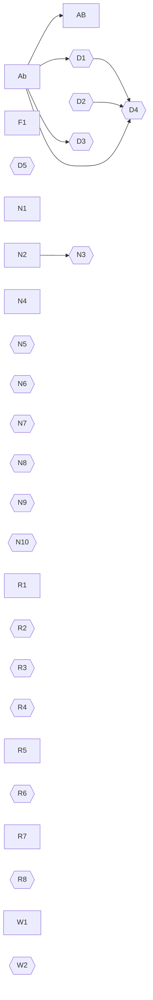

## Notes

Only the first `## Phase table` section is read. The next line is a task item
in another section, so it is not a row.

- [ ] **Z9** Not a row, wrong section: #99

## Phase table notes

A heading that only begins with the section name is another section.

- [ ] **Z7** Not a row, prefix-named section: #97

## phase table

The heading match ignores ASCII case. These lines are not rows and are ignored:

- a plain bullet
* [ ] **S1** An asterisk task item: #91
1. [ ] **S2** An ordered task item: #92
  - [ ] **S3** An indented task item: #93
#### A deeper heading does not start a phase

- [X] **Ab** Upper-case X is done: #1
- [ ] **AB** Ids are case-sensitive: #2 · after Ab

A code fence hides nothing, so the task item inside this one is a row:

```text
- [ ] **F1** A row inside a code fence is still a row: #3
```

### Dependencies

- [ ] **D1** The last marker wins · after hours · after Ab
- [ ] **D2** Clean up · afterwards
- [ ] **D3** Two spaces after the marker · after  Ab
- [ ] **D4** A comma may have spaces and a tab around it · after D1,D2 ,	Ab
- [ ] **D5** A bullet dot is not the marker • after Ab

### Notes and refs

- [ ] **N1** Parentheses before the ref stay in the title (kept): #4
- [ ] **N2** Nested notes: #5 (see (a) and (b))
- [ ] **N3** Only the last group is notes (title) (notes) · after N2
- [ ] **N4** Notes are trimmed: #6 (  padded  )
- [ ] **N5** An unbalanced parenthesis stays in the title :)
- [ ] **N6** Run `deploy()` then verify()
- [ ] **N7** Call render(x)
- [ ] **N8** (draft)
- [ ] **N9** An empty group is not notes ()
- [ ] **N10** A blank group is not notes (  )

A bare heading marker has no name, so the phase does not change:

###

- [ ] **R1**   Extra spaces around the title are trimmed  : example/alpha#7
- [ ] **R2** A ref needs a colon and one space:#8
- [ ] **R3** Two spaces after the colon:  #9
- [ ] **R4** A number alone is a title: 12
- [ ] **R5** Names may use dots, underscores and hyphens: example-org/alpha_beta.rs#10
- [ ] **R6** A number has no leading zero: #007
- [ ] **R7** Fifteen digits is the longest number: #123456789012345
- [ ] **R8** Sixteen digits is not a ref: #1234567890123456

###  No-break spaces

The phase name above is trimmed of its extra space. The two rows below each
carry one U+00A0 NO-BREAK SPACE, which is text and is never trimmed: before the
colon in the first, at the very end of the second.

- [ ] **W1** A no-break space before the colon is title text : #11
- [ ] **W2** A trailing no-break space is title text: #12 

## dependency graph

This heading match ignores ASCII case too. Only an exact fence opens the block,
so the next two blocks are skipped, and lines outside the block are not
compared.

```Mermaid
graph LR
  stale
```





## Phase table

- [ ] **Z8** A second phase table is not read: #98
