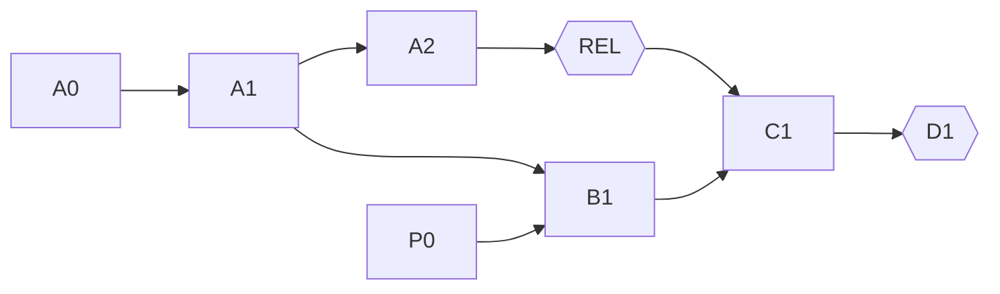

## Purpose

Program key **`example-rollout-2026-01`**. Fixture: a complete tracker body
that uses every row form of the grammar.

## How to resume (read this first)

1. Read this body, then the latest checkpoint comment on this issue.
2. Pick the first unchecked item whose dependencies are all checked; items in
   one phase may run in parallel.

## Decisions (settled 2026-01-05)

- The projection ships in two steps under one issue.

## Phase table

- [x] **P0** Agree the plan: #10

### Phase 1: Foundations

- [x] **A0** Schema: draft (v2) and `parse()` entry point: example/alpha#12 (PR example/alpha#15)
- [x] **A1** Local projection, step 1: example/alpha#14 (PR example/alpha#16) · after A0
  - [x] merged behind a flag
- [ ] **A2** Local projection, step 2: example/alpha#14 · after A1

Items in one phase may run in parallel.

### Phase 2: Rollout

- [ ] **B1** Board shows `open | done` counts: #21 · after A1, P0
- [ ] **REL** Release containing A2 (tag v1.2.0) · after A2
- [ ] **C1** Adopt the release: example/beta#7 (blocked until REL) · after REL, B1
- [ ] **D1** Decide whether to retire the old view · after C1

## Dependency graph

## Open decisions

- Whether the old view is retired; blocks D1.

## Checkpoint log

Progress is recorded as comments on this issue. Keep the phase table in sync
with closed children.
