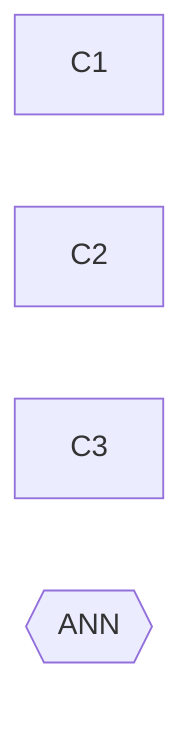

## Purpose

Program key **`example-cleanup-2026-02`**. Fixture: independent items with no
ordering between them.

## Phase table

### Phase 1: Cleanup

- [x] **C1** Remove the legacy exporter: example/alpha#30 (PR example/alpha#33)
- [ ] **C2** Remove the legacy importer: example/alpha#31
- [ ] **C3** Update the operator guide: example/docs#4
- [ ] **ANN** Announce the removal

## Dependency graph

